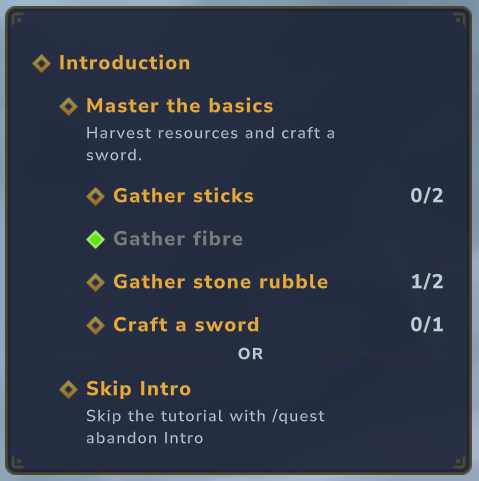

# OpenQuests

An extensible quest system for Hytale server plugins.

Quests are split in two: an **asset** describes a quest (its title, its parameters, its rewards) and
is authored as JSON and editable in the AssetEditor, while a **quest progression** carries players
progression and is persisted on its own. The two are linked by the asset id, so editing a quest
definition never touches saved progression.



One quest, as the tracker draws it. *Introduction* combines its two children with `OR`, so either
branch ends it — hence the rule between them. *Master the basics* combines its own four with `AND`,
and nests one level further. *Gather fibre* is done: complete icon, greyed, counter dropped. The two
grey lines are descriptions, shown because their assets carry the `OQ_HUD_DESC` tag.

## Modules

| Module | Plugin | Role |
| --- | --- | --- |
| `core` | `OpenQuestsCore` | The system itself. Ships no quest type, only the core system: assets, progression, scopes, history, rewards. |
| `extension` | `OpenQuests` | The implementation: quest types, rewards and tracker HUD shipped on top, one package per feature. |

Depending on `OpenQuestsCore` alone is enough to build your own quest types;
`OpenQuests` is both a set of ready-made types and the reference for how to add one.

## Concepts

| Piece | Role |
| --- | --- |
| `QuestAsset` | Immutable definition loaded from `OpenQuests/Quests/*.json`. Polymorphic on `"Type"`. |
| `AbstractQuestProgression` | Runtime instance holding state, assignees and progression. Polymorphic on `"Type"`. |
| `QuestVisitor` | Carries the context of an event to the quests it can progress. |
| `QuestReward` | What a terminal state grants. Polymorphic on `"Type"`. |
| `QuestProgressionService` | Entry point: register, progress, complete, unregister. |
| `QuestHistoryStore` | Per-player record of completed quests, with claim state and date. |

### Handing quests out

There is no separate assignment concept: a quest is handed out in one of three ways, and the
prerequisites of a quest are other quests.

- **On connection** — `"StartOnConnection": true` gives the quest to every player, once. Only the
  ids already handed out are kept between sessions, so a quest nobody took costs one string.
- **As a reward** — the `GrantQuest` reward hands further quests over when a quest completes. This
  is how a chain is written: finishing A grants B.
- **Explicitly** — `QuestProgressionService.registerQuest(asset).addPlayer(playerId)`, from a
  command or from your own plugin.

A quest gating on another one is a `QuestState` quest, usually as the child of a composite. Since a
quest holds a state rather than a boolean, "not yet" and "failed" stay distinct — which is what
lets a composite fail rather than hang.

### Scopes

A quest only ever knows its players: `AbstractQuestProgression` is the single source of truth,
and `QuestStoreComponent` is the reverse index used to know what to load. Scope is applied from
the outside, from `core/scopes/`, and each scope package is self-contained — the rest of the core
never depends on it, only the reverse.

#### Player scope
Quests assigned to named players, the default path.

#### Universe scope
Quests assigned to every player on the server. Useful for community goals:
- Reach 100 unique players
- Kill 1 000 000 skeletons

#### World scope
Quests assigned to every player entering a world, and removed when they leave. Useful for
instanced events:
- Slay the Devil Boss
- Reach the 10th zombie wave

### Storage

Progression is written where it costs least. A quest with a single player is held whole inside
that player's own file; one shared by several gets a file of its own. A quest that gains a second
player moves from the first to the second and stays there: moving it back would lose it on the
way.

None of this is visible from the outside: `QuestProgressionService` resolves a quest by id
whichever store holds it.

### Lifecycle

A quest is created from its asset, progresses through visitors, and on reaching a terminal state
(`SUCCESSFUL`, `FAILED`, `ABANDONED`) is archived into each assignee's history and unregistered.
Rewards are granted immediately when `AutoClaim` is set; one that could not be granted — a full
inventory, an offline player — stays pending on the history record and is retried on the next
world entry.

Three asset flags change what a quest does when it completes:

| Flag | Default | Effect when `false` |
| --- | --- | --- |
| `StopOnComplete` | `true` | The quest keeps running once complete, staying re-evaluable, so its state can still change. Nothing is recorded and no reward is granted until it stops. |
| `PersistProgression` | `true` | Progression is never written to disk; a restart forgets it. |
| `PersistHistory` | `true` | Nothing is recorded on completion. Rewards not granted on the spot are lost, since nothing is left to retry them from. |

`PersistHistory` can also be set on a running quest, which is how a composite applies its
`PersistChildrenHistory` flag — off by default, so the steps of a chain do not pile up in the
log next to the chain itself. Turn it on for children carrying rewards of their own: a reward
that could not be granted on the spot has nowhere to wait.

## Built-in quest types

| Type | Completes on |
| --- | --- |
| `Gather` | Holding a quantity of an item, recounted on every inventory change. |
| `InteractivelyPickup` | Picking up a quantity through the harvest interaction. |
| `Craft` | Crafting a quantity of an item, whatever the recipe. |
| `UseBlock` | Interacting with a block a number of times. |
| `BreakBlock` | Breaking a number of blocks, named by id or by block tag. |
| `PlaceBlock` | Placing a number of blocks, matched on the item they are placed from. |
| `Consume` | Eating or drinking a quantity of an item. |
| `UseEntity` | Interacting with NPCs of a group a number of times. |
| `KillNpc` | Killing NPCs of a group, either an existing one or one written inline. |
| `KillPlayer` | Killing players, optionally a designated one. |
| `ReachLocation` | Entering a radius around a position. |
| `EnterWorld` | Entering a world whose name matches a regular expression. |
| `Walk` | Covering a distance at the slow pace, the one the player holds a key for. |
| `Run` | Covering a distance at the default pace. |
| `Sprint` | Covering a distance at the fast pace. |
| `Jump` | Jumping a number of times. |
| `Composite` | Its children, combined with `AND` or `OR`. `OR` children are separated in the tracker by an `OR` rule. |
| `QuestState` | Another quest reaching a state, optionally negated with `Not`. Can go back to `IN_PROGRESS`, so it also expresses a standing obligation. |

The tracker only lists quests that asked for it. `AutoTrack` puts every quest made from the asset on
the panel; `OQ_HUD_DESC` shows its description under its title, greyed and smaller:

```json
{ "Type": "Composite", "TitleKey": "…", "AutoTrack": true, "Tags": { "OQ_HUD_DESC": [] } }
```

What the player then does with it is written on the quest rather than on the asset, through
`QuestTrackService`: `track`, `untrack`, `toggle`, and `reset` to hand the answer back to the asset.
`getTracked(playerId)` reads the list back as quest ids, and `replaceTracked` swaps it for another
and returns what it took — which is how a game mode borrows the tracker for a round and gives it
back. The core declares both fields and reads neither: what being followed amounts to is the
extension's business, the same way it owns what a `TitleKey` ends up drawn on.

A running quest carries tags of its own, through `addTag` and `removeTag`, and is asked before its
asset — the same override as `PersistHistory`, so one quest can answer differently from everything
sharing its template. Its tags carry values just as an asset's do, and the instance answers alone
once it declares one, so a quest can be written over at runtime rather than only added to.

`OQ_HIDE` outranks the lot: a quest carrying it is on neither the panel nor the journal, whatever
else it asked for. What it owes the player is untouched — a debt is listed in its own right, so a
quest the player is not meant to read about still pays out.

A quest drawn under another one — the steps of a chain — is drawn by its parent, and an inline step
inherits nothing from the chain it is written inside: its tags are its own. So a step is on the
panel on the same terms as anything else, and asking for one is how a player narrows a long chain
down to what they are doing now. Keeping the chain up beside it is theirs to decide too.

Every counted type extends `QuantityQuestAsset`, which carries `TargetQuantity`. The parameter and
the target can both be overridden on the progression itself, serialized only when set and falling
back to the asset otherwise — so a quest handed out from a shared template can still target
something of its own.

### Ending a quest

A quest that ends says so: its title takes over the middle of the screen, over a line naming the
outcome, and a sound plays. A quest a script abandons rather than the player passes in silence, as
does one carrying `OQ_HIDE`.

Each outcome names its own sound, a vanilla sound event or one your asset pack ships. The empty
string plays nothing.

```json
{ "SuccessfulSound": "SFX_Memories_Unlock_Local", "AbandonedSound": "" }
```

### Commands

`/quest create player|world|universe <assetId> …` hands a quest out. `/quest complete`,
`/quest fail` and `/quest abandon` write that state onto the sender's quests, taking either one quest
id or an asset id — the second reaches every quest they hold from it. They go through the ordinary
progression path, so `StopOnComplete` still decides whether the quest stops there.

Permissions are generated from the plugin and the command path, so `/quest complete` answers to
`martelstudios.openquestcore.command.quest.complete`. The whole tree is granted to
`hytale:WorldEditor` except `/quest abandon` granted to `hytale:Adventurer`. A player can give up a quest of their own. Each command only ever
reaches the sender's quests, so the wider group grants nothing over anybody else.

## Built-in rewards

- `Item` — gives items, hotbar first, all or nothing.
- `GrantQuest` — hands further quests over, linked by id or written inline.
- `Command` — runs a server or player command. `{player}` is replaced by the username, so
  `"Command": "give {player} Ingredient_Stick 5"` works. A leading slash is optional. Runs as the
  console unless `"AsPlayer": true`, which runs it with the permissions of the player instead.

## Extending

Group everything a type needs in one package — asset, progression, visitor, systems — and give it a
single entry point, the way each package of `OpenQuests` does:

```java
public final class MyFeature {
    public static void register(@Nonnull JavaPlugin plugin) {
        QuestProgressionService.get().registerQuestType(
            "MyType",
            MyQuestAsset.class, MyQuestAsset.CODEC,
            MyQuestProgression.class, MyQuestProgression.CODEC
        );

        plugin.getEntityStoreRegistry().registerSystem(new MyEventSystem());
    }
}
```

Your plugin's `setup()` then only lists its features, and never grows past that.

A reward type is registered the same way:

```java
QuestReward.CODEC.register("MyReward", MyQuestReward.class, MyQuestReward.CODEC);
```

A quest type also says how it shows itself in the tracker, by registering a `QuestHudRenderer`:

```java
QuestHudService.register(new MyQuestHudRenderer());
```

The panel picks which five quests get in and stops there; everything past that is the renderer's:
lines, colours, progress. A renderer never knows where its lines land: a quest listing others opens
a container and draws them into it, so the same renderer serves a quest at the top of the panel and
one listed under another. `QuestHudRows` holds the plain look and the fallback for a type that
registered nothing. Registering on a base type covers every type built on it, which is how one
renderer draws the counter of every counted quest.

Anything a type needs beyond the core contract stays in its own package — `Composite` validates its
asset graph at boot from `CompositeFeature`, the tracker HUD renders counted quests from its own
package. The core never learns about them.

## Example assets

A quest, in `OpenQuests/Quests/CollectStick.json`:

```json
{
  "Type": "Gather",
  "TitleKey": "quest.collect-stick.title",
  "DescriptionKey": "quest.collect-stick.description",
  "AutoClaim": true,
  "ItemToGather": { "ItemId": "Ingredient_Stick" },
  "TargetQuantity": 20,
  "SuccessfulRewards": [
    { "Type": "Item", "ItemId": "Plant_Fruit_Berries_Red", "Quantity": 5 }
  ]
}
```

A quest chain, in `OpenQuests/Quests/StartHatchet.json`. It reaches every player on connection and
hands the next one over when it completes:

```json
{
  "Type": "Composite",
  "TitleKey": "quest.start-hatchet.title",
  "DescriptionKey": "quest.start-hatchet.description",
  "StartOnConnection": true,
  "AutoClaim": true,
  "QuestAssetIds": [
    "CollectStick",
    { "Type": "Gather", "TitleKey": "…", "DescriptionKey": "…", "ItemToGather": { "ItemId": "Ingredient_Fibre" }, "TargetQuantity": 5 }
  ],
  "SuccessfulRewards": [
    { "Type": "GrantQuest", "QuestAssetIds": ["PickBerries"] }
  ]
}
```

A quest targeting NPCs takes an `NPCGroup` the same way, so a single role does not need a group
asset of its own:

```json
{ "Type": "KillNpc", "NpcGroupId": { "IncludeRoles": ["Golem_Crystal_*"] }, "TargetQuantity": 3 }
```

Each entry of `QuestAssetIds` is either the id of an existing asset or an inline definition, which
is registered as an asset of its own under a generated id. The same goes for `GrantQuest`.

Enum values are written in CamelCase: `Successfully`, `InProgress`, `And`, `Or`.

Text lives in `Server/Languages/<locale>/*.lang`, whose file name is the first segment of every key
it holds — `hud.or` in `openquests.lang` answers to `openquests.hud.or`. The server loads them and
pushes them to clients, so they resolve from markup as `%openquests.hud.or` and from code as
`Message.translation(...)` alike. `en-US` and `fr-FR` ship.

`TitleKey` and `DescriptionKey` are optional. Without them a quest falls back to
`getDefaultTitle()`, which a type overrides to describe itself from its own parameters — a `Gather`
quest reads "Gather 2 Sticks" on its own, the item naming itself through Hytale's own
`Item.getTranslationMessage()`. The templates live in the same files and use ICU, so a locale
pluralises where it needs to.

Quest asset graphs are validated at boot: an unknown reference or a cycle between composite quests
stops the server with an explicit reason rather than failing later at runtime.

## Building

```bash
./gradlew build
```

## License

MIT — see [LICENSE](LICENSE).
